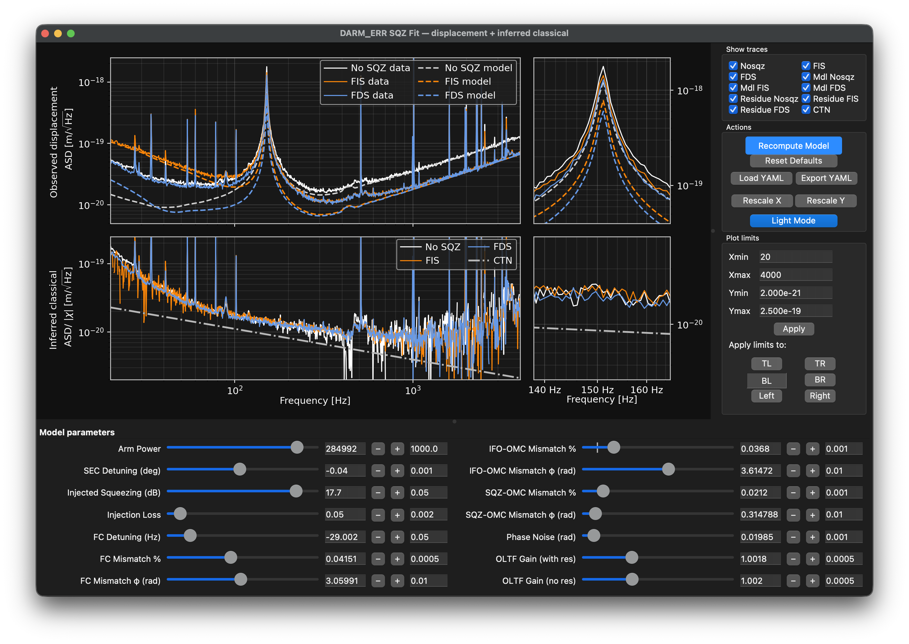
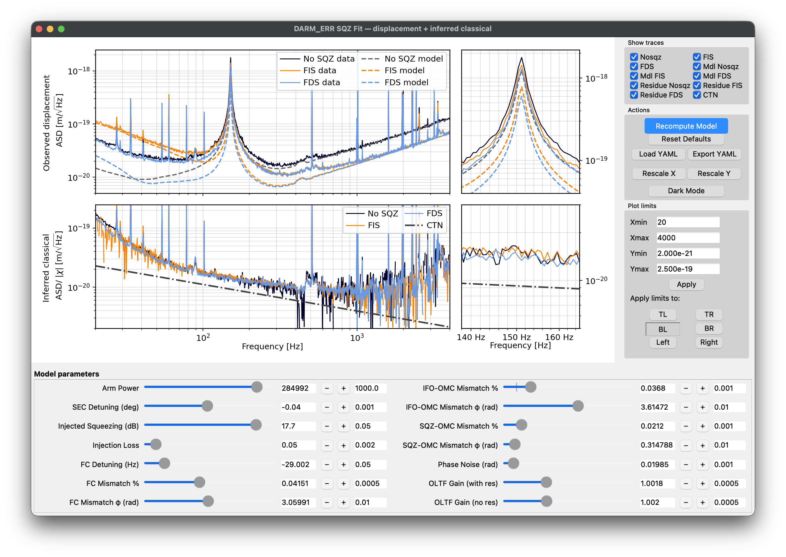

# DARM squeezing fit GUI

Interactive Python/Qt GUI for comparing calibrated DARM_ERR displacement spectra with GWINC quantum-noise models for no squeezing, frequency-independent squeezing, and frequency-dependent squeezing.

This tool was developed for the analysis associated with **“Observing and Evading Quantum Back-Action on a Kilogram-Scale Oscillator”**.  
Paper: [arXiv:2609.19317](https://arxiv.org/abs/2609.19317)

The GUI plots measured spectra, GWINC model curves, zoomed-in panels around the optomechanical mode, and inferred classical residuals after subtracting the modeled quantum contribution. It also provides sliders/text boxes for fit parameters, trace visibility controls, plot-limit controls, light/dark plotting modes, and YAML export/load support for saving and restoring fit configurations.

## GUI

Dark Mode:


Light Mode:


## Files

```text
sqzfit_gui_with_optomech_mode.py
utils.py
april9.yaml
gwinc_fds_fit_params_20260819_114635.yaml
calibrated_darm_err_with_resonance.mat
unwrapped_oltf_with_resonance.mat
unwrapped_oltf_no_resonance.mat
sqzfit_gui_screenshot_darkmode.png
sqzfit_gui_screenshot_lightmode.png
README.md
requirements.txt
.gitignore
```

The file `unwrapped_oltf_no_resonance.mat` is optional. If it is not present, the GUI falls back to using the resonant OLTF file for the no-resonance denominator.

## Prototype slow GUI folder

The subfolder proto_gui_slow/ contains an earlier prototype version of the fitting GUI. This version is kept for reference and for preserving the development history of the interface, but it is not the recommended entry point for routine fitting.

That prototype is slower primarily because it uses Matplotlib widgets directly for the full interface and performs the GWINC model updates synchronously on the main GUI thread. Each model update can rerun the quantum-noise calculation for multiple squeezing configurations and then redraw the full set of curves and controls. This makes the interface responsive enough for testing and comparison, but noticeably slower during interactive fitting than the newer working GUI.

## Input data format

The calibrated DARM `.mat` file is expected to contain:

- `ff_err`: frequency vector
- `darm_err_calib`: calibrated DARM_ERR ASD array with rows corresponding to `no_sqz`, `fis`, and `fds`

The OLTF `.mat` files are expected to contain:

- `ff`: frequency vector
- `new_mag`: OLTF magnitude in dB
- `new_phase`: OLTF phase in degrees

## Installation

Install the Python dependencies with:

```bash
pip install -r requirements.txt
```

The GUI uses Matplotlib's Qt backend. The `requirements.txt` file lists `PyQt5` by default. If running inside a LIGO-managed conda environment that already provides Qt bindings and GWINC, the environment packages may be sufficient.

## Running

From the repository directory:

```bash
python sqzfit_gui_with_optomech_mode.py
```

By default, the script looks for the input YAML and `.mat` files in the same directory as the script:

```text
april9.yaml
calibrated_darm_err_with_resonance.mat
unwrapped_oltf_with_resonance.mat
unwrapped_oltf_no_resonance.mat
```

## GUI controls

### Model parameters

The bottom panel contains sliders and text boxes for the main model parameters, including:

- arm power
- SEC detuning
- injected squeezing
- injection loss
- filter-cavity detuning
- filter-cavity mismatch and mismatch phase
- IFO-OMC mismatch and mismatch phase
- SQZ-OMC mismatch and mismatch phase
- phase noise
- OLTF gain with resonance
- OLTF gain without resonance

The vertical marker on each slider indicates the current default value. When a saved YAML file is loaded, the loaded values become the new defaults.

### Actions

- **Recompute Model**: reruns the GWINC model and updates the model and residual curves.
- **Reset Defaults**: resets all sliders to the current default values.
- **Load YAML**: loads a GWINC YAML file and updates the GUI sliders/default markers.
- **Export YAML**: saves the current GUI-controlled fit parameters into a new YAML file.
- **Rescale X / Rescale Y**: rescales the selected plot region.
- **Light Mode / Dark Mode**: toggles the plot theme.

### Plot limits

The plot-limit controls can be applied to:

- `TL`: top-left plot
- `TR`: top-right zoom plot
- `BL`: bottom-left plot
- `BR`: bottom-right zoom plot
- `Left`: both left plots
- `Right`: both right plots

No plot-limit target is selected by default. Clicking a selected target again clears the selection.

## YAML export/load behavior

The **Export YAML** button writes a new YAML file based on the currently loaded YAML, updating the GUI-controlled GWINC parameters.

The **Load YAML** button loads a YAML file, updates the sliders, updates the default slider markers, and recomputes the model.

The two OLTF gain sliders are GUI-only fit parameters, so they are saved under:

```yaml
FitUI:
  OLTFGainWithRes: ...
  OLTFGainNoRes: ...
```

Generated fit YAML files are ignored by default unless manually added to git.

## AI-assisted development

OpenAI language models were used to assist with code organization, interface design, and usability improvements. Scientific modeling choices, parameter definitions, experimental interpretation, and validation were performed by the author.

## Notes

This tool was developed for interactive analysis of DARM squeezing data and GWINC quantum-noise fits. It assumes the input `.mat` files have the expected structure described above.
