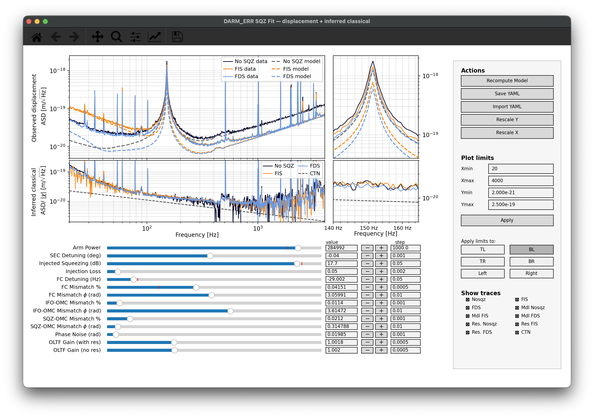

# Prototype DARM squeezing fit GUI \(slow version\)

Interactive prototype GUI for comparing calibrated DARM_ERR displacement spectra with GWINC quantum-noise models for no squeezing, frequency-independent squeezing, and frequency-dependent squeezing.

This folder contains an earlier Matplotlib-widget implementation of the DARM squeezing fit GUI. It is kept for reference, provenance, and comparison with the newer GUI version. For day-to-day fitting and presentation-quality interaction, use the newer GUI in the main `sqzfit_gui_with_optomech_mode` folder.

## GUI



## Why this version is slower

This prototype prioritizes transparency and quick development over GUI responsiveness. It can feel slow or temporarily unresponsive for several reasons:

- The interface is built using Matplotlib widgets embedded directly in the figure, rather than a native Qt layout. This makes the controls easy to prototype, but less responsive than a dedicated Qt-widget interface.
- Pressing **Recompute Model** reruns the GWINC quantum-noise model for the no-squeezing, FIS, and FDS cases.
- The GWINC calculations are done synchronously in the same process as the GUI. While the model is running, the window may pause until the calculation finishes.
- The model is evaluated on a dense logarithmic frequency grid, so each recomputation updates many plotted points and multiple line objects.
- The prototype does not use background workers, model caching, or incremental updates. Each recomputation is intentionally straightforward and self-contained.

Slider changes update the displayed parameter values and mark the model as changed, but the curves are only updated after pressing **Recompute Model**. This makes it best to adjust several sliders first, then recompute once.

## GUI controls

### Model parameters

The lower part of the figure contains sliders and text boxes for the main model parameters, including:

- arm power
- SEC detuning
- injected squeezing
- injection loss
- filter-cavity detuning
- filter-cavity mismatch and mismatch phase
- IFO-OMC mismatch and mismatch phase
- SQZ-OMC mismatch and mismatch phase
- phase noise
- OLTF gain with resonance
- OLTF gain without resonance

Each row includes a slider, a typed value box, minus/plus buttons, and a step-size box. Slider or text-box edits update the stored parameter value. Press **Recompute Model** to rerun GWINC and update the plotted model and residual curves.

### Actions

- **Recompute Model**: reruns the GWINC model and updates the model and residual curves.
- **Save YAML**: writes a new GWINC YAML file using the current GUI-controlled fit parameters.
- **Import YAML**: loads a GWINC YAML file, updates the sliders, and recomputes the model.
- **Rescale X / Rescale Y**: rescales the selected plot region.
- **Apply**: applies the typed plot limits to the selected plot region.

### Show traces

The **Show traces** checkboxes toggle the visibility of the data, model, residual, and coating-thermal-noise curves. The legend updates after traces are shown or hidden.

### Plot limits

The plot-limit controls can be applied to:

- `TL`: top-left plot
- `TR`: top-right zoom plot
- `BL`: bottom-left plot
- `BR`: bottom-right zoom plot
- `Left`: both left plots
- `Right`: both right plots

## YAML export/import behavior

The **Save YAML** button writes a new YAML file based on the currently loaded YAML, updating the GUI-controlled GWINC parameters.

The **Import YAML** button loads a YAML file, updates the sliders, and recomputes the model.

The two OLTF gain sliders are GUI-only fit parameters, so they are saved under:

```yaml
FitUI:
  OLTFGainWithRes: ...
  OLTFGainNoRes: ...
```

Generated fit YAML files are ignored by default unless manually added to git.

## Performance notes

For smoother use:

- adjust several sliders before pressing **Recompute Model**;
- avoid repeatedly importing YAML files unless a recomputation is desired;
- wait for the terminal message `Done.` before interacting heavily with the window again;
- use the newer GUI version for more responsive interactive fitting.

## LLM assistance disclosure

The UI layout and usability refinements in this prototype were optimized with assistance from OpenAI GPT-5.5 Thinking. The scientific model choices, input data, parameter interpretation, and final validation remain the responsibility of the author/user. The LLM assistance was used for code organization and interface iteration, not as an independent scientific validation of the analysis.

## Notes

This tool was developed for interactive analysis of DARM squeezing data and GWINC quantum-noise fits. It assumes the input `.mat` files have the expected structure described above. This prototype is intentionally retained as an earlier, slower implementation for comparison with later GUI versions.
